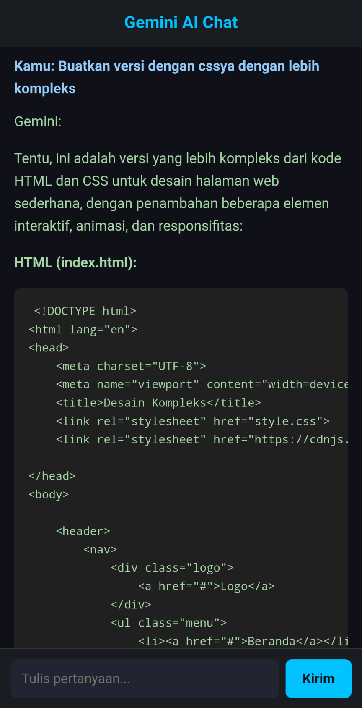

# Gemini ESP32 Web AI Chat

Proyek ini memungkinkan ESP32 untuk menjadi web server yang menghosting antarmuka chat berbasis Gemini API langsung dari perangkat IoT. Dibuat menggunakan **Arduino IDE**, proyek ini memungkinkan pengguna untuk berinteraksi dengan Gemini AI melalui jaringan lokal.

## Fitur

* Menjadikan ESP32 sebagai web server (port 80)
* Antarmuka web interaktif dengan UI modern
* Menggunakan Gemini 2.0 Flash API dari Google untuk pemrosesan pertanyaan
* Mendukung respons markdown (ditampilkan dengan `marked.js`)
* Optimal untuk perangkat low-power seperti ESP32

## Prasyarat

* **ESP32 Board**
* **Arduino IDE** dengan:

  * Board ESP32 sudah diinstal [arduino-esp32](https://raw.githubusercontent.com/espressif/arduino-esp32/gh-pages/package_esp32_index.json)
  * Library `WiFi.h` dan `WebServer.h` (biasanya sudah bawaan ESP32 core)
* API Key dari [Google AI Studio](https://aistudio.google.com)
* Koneksi Wi-Fi aktif

## Instalasi
1. **Clone repositori ini**

   ```bash
   git clone https://github.com/Katryoshkh/Gemini-ESP32-Web-AI-Chat.git
   ```

2. **Buka file `.ino` di Arduino IDE**

3. **Masukkan kredensial Wi-Fi & API Key**

   ```cpp
   const char* ssid = "YOUR_SSID";
   const char* password = "YOUR_WIFI_PASSWORD";
   ...
   const API_KEY = "YOUR_API_KEY";
   ```

4. **Unggah ke ESP32**
   Pastikan kamu memilih board dan port yang sesuai di Arduino IDE.

5. **Buka Serial Monitor**
   Setelah terkoneksi, buka alamat IP yang muncul di browser kamu.

## Cara Pakai

* Ketikkan pertanyaanmu di kolom input.
* Klik tombol **"Kirim"** atau tekan `Enter`.
* Respons akan ditampilkan dengan format markdown.

## Screenshot

*Tampilan antarmuka web akan terlihat seperti ini:*
 *

## Catatan Penting

* Gunakan API Key pribadi dan jangan share secara publik.
* Proyek ini **tidak melakukan hosting model AI di perangkat**, hanya menjadi antarmuka ke cloud Gemini API.
* Pastikan koneksi internet stabil saat digunakan.

## Lisensi

MIT License - bebas digunakan dan dimodifikasi.
